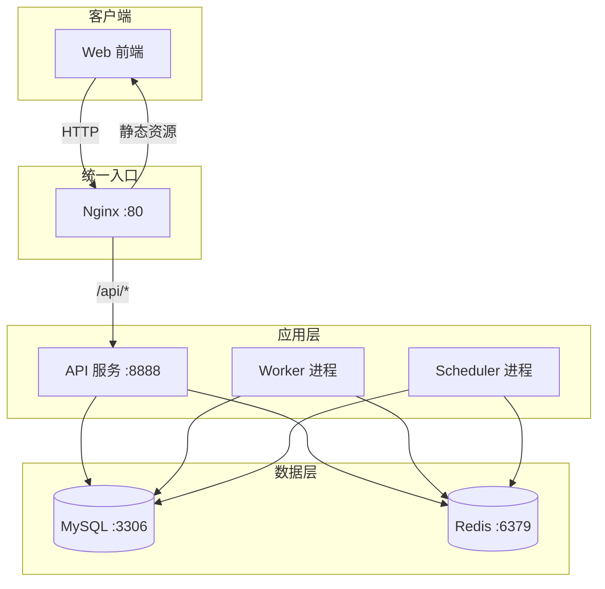
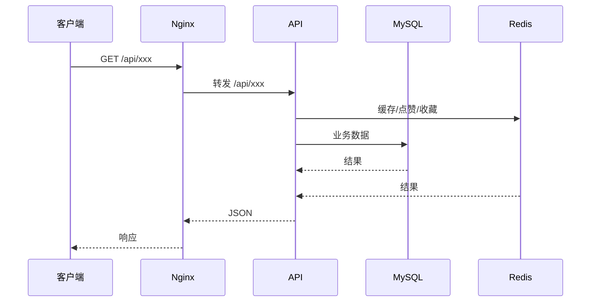
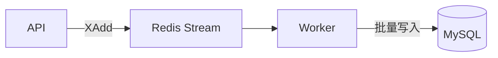

# 后端架构 v1：增强型单体

本文档描述图书管理系统后端架构 v1 的形态、部署方式与运维说明。

---

## 1. 架构图

### 1.1 整体架构



### 1.2 请求链路



### 1.3 异步链路（点赞 / 收藏）



---

## 2. 核心组件

| 组件 | 职责 | 端口（容器内） |
|------|------|----------------|
| **API** | HTTP 接口、认证、业务逻辑 | 8888 |
| **Worker** | 消费 Redis Stream，异步落库点赞/收藏 | - |
| **Scheduler** | 定时任务：逾期检查、到期提醒、预约过期、自动拉黑、黑名单过期 | - |
| **Nginx** | 静态资源、/api 反向代理、健康检查 | 80 |
| **MySQL** | 持久化存储 | 3306 |
| **Redis** | 缓存、点赞/收藏状态、Stream、分布式锁 | 6379 |

---

## 3. 后端操作说明

### 3.1 运行模式

主程序支持五种运行模式，通过 `-mode` 参数指定：

| 模式 | 说明 | 适用场景 |
|------|------|----------|
| `api` | 仅启动 HTTP 服务 | 生产多实例、独立扩缩容 |
| `worker` | 仅启动 Redis Stream 消费 | 单独扩 Worker |
| `scheduler` | 仅启动定时任务 | 单实例跑定时任务 |
| `all` | API + Worker + Scheduler 一体 | 本地开发、小规模部署 |
| `migrate` | 仅执行数据库迁移与种子数据，不启动服务 | 首次初始化、CI/CD |

**示例：**

```bash
# 本地开发（默认 all）
go run main.go

# 仅 API
go run main.go -mode=api

# 仅 Worker
go run main.go -mode=worker

# 仅执行迁移
go run main.go -mode=migrate
```

### 3.2 本地运行（开发环境）

**前提：** MySQL、Redis 已启动（可用 Docker 或本地安装）

**说明：** 本地开发不需要 Nginx。Vue 的 dev server 会代理 `/api` 到后端，前端和后端分别在两个终端运行即可。

**后端：**

```bash
# 1. 启动依赖（若使用 Docker，仅启动 MySQL 与 Redis）
docker compose up -d mysql redis

# 2. 执行迁移（首次或 schema 变更后）
go run main.go -mode=migrate

# 3. 启动后端（一体模式）
go run main.go
# 或
./start-backend.sh
```

**前端：**

```bash
cd web
npm install   # 首次需安装依赖
npm run serve
```

- 后端默认监听 `http://0.0.0.0:8888`
- 前端 dev server 监听 `http://localhost:8080`，并将 `/api/*` 代理到 `http://localhost:8888`
- 本地开发时访问 `http://localhost:8080` 即可，API 请求由 Vue 代理转发

### 3.3 容器化部署（生产）

```bash
# 1. 构建后端镜像（仅需在代码或依赖变更时执行）
docker build -t bookadmin:latest .

# 2. 启动完整栈（MySQL、Redis、migrate、api1/api2/api3、worker、scheduler、nginx）
docker compose up -d

# 3. 查看服务状态
docker compose ps
```

**服务说明：**

- `migrate`：单次执行，完成后退出
- `api1` / `api2` / `api3`：三个 API 实例，由 Nginx 做负载均衡
- `worker`：异步消费
- `scheduler`：定时任务
- `nginx`：对外入口，端口 80

**访问：**

- 前端：`http://localhost`
- API：`http://localhost/api/xxx`

### 3.4 配置说明

配置优先级：**环境变量 > config.yaml**。

**配置文件：** `config.yaml`（可通过 `CONFIG_PATH` 指定路径）

**主要环境变量：**

| 变量 | 说明 | 示例 |
|------|------|------|
| `APP_ENV` | 运行环境 | `development` / `production` |
| `SERVER_PORT` | API 端口 | `8888` |
| `MYSQL_PATH` | MySQL 地址 | `127.0.0.1:3306` 或 `mysql:3306` |
| `MYSQL_DB_NAME` | 数据库名 | `bookadmin` |
| `MYSQL_USERNAME` | 用户名 | `root` |
| `MYSQL_PASSWORD` | 密码 | `root` |
| `REDIS_ADDR` | Redis 地址 | `127.0.0.1:6379` 或 `redis:6379` |
| `JWT_SECRET` | JWT 密钥 | **生产必须修改** |
| `SECURITY_CORS_ALLOWED_ORIGINS` | CORS 允许源 | `http://localhost` |
| `SECURITY_SEED_DEFAULT_USERS` | 是否初始化默认用户 | `true` / `false` |

生产环境可参考 `.env.example`，配合 `docker compose --env-file .env up -d` 使用。

---

## 4. 关键接口

| 路径 | 说明 |
|------|------|
| `GET /healthz` | 存活探针，返回 `ok` |
| `GET /readyz` | 就绪探针，校验 DB/Redis 连接 |
| `GET /metrics` | Prometheus 指标 |
| `POST /api/auth/login` | 登录 |
| `POST /api/auth/register` | 注册 |

---

## 5. Worker 异步链路说明（sync_worker.go）

Worker 负责消费 Redis Stream 中的点赞/收藏消息，批量落库到 MySQL。本次架构演进对其做了以下增强。

### 5.1 配置化

原先超时、批次大小、消费者组名等均为硬编码。现统一从 `config.yaml` 的 `worker` 段读取，支持环境变量覆盖：

| 配置项 | 说明 | 默认值 |
|--------|------|--------|
| `pool-size` | Worker 池大小 | 5 |
| `consumer-group` | Redis Stream 消费者组 | sync-group |
| `batch-size` | 每批处理消息数 | 100 |
| `batch-timeout-seconds` | 单批处理超时 | 5 |
| `block-timeout-seconds` | XREADGROUP 阻塞时间 | 1 |
| `reclaim-interval-seconds` | 扫描 pending 的间隔 | 15 |
| `min-idle-seconds` | 超过此空闲时间的消息视为 pending | 30 |
| `max-retry` | 超过此次数转入死信队列 | 5 |
| `dead-letter-stream` | 死信队列 Stream 名 | stream:dead-letter:sync |

### 5.2 Pending 消息 reclaim

通过 Redis 的 `XPending` / `XClaim` 实现：

- **问题**：消息被投递给 consumer 后未 ACK（进程崩溃、超时等）会一直处于 pending 状态。
- **处理**：后台 `reclaimLoop` 按 `reclaim-interval-seconds` 定时执行：
  1. 查询消费者组内 pending 且 idle 超过 `min-idle-seconds` 的消息
  2. 若 `RetryCount > maxRetry`：写入死信队列并 ACK，不再重试
  3. 否则：`XClaim` 认领后重新调用 `processor` 处理

这样其他 worker 崩溃后遗留的 pending 消息会被本 worker 回收并重试。

### 5.3 死信队列（DLQ）

无法处理或重试超限的消息会写入 `dead-letter-stream`，并带上：

- `source_stream`：来源 Stream
- `original_id`：原始消息 ID
- `worker_id`：处理该消息的 worker
- `reason`：失败原因（如 `retry_count_exceeded`、`missing_action` 等）
- `payload`：原始消息内容

写入 DLQ 后，仍会对原 Stream 做 XACK，避免被重复消费。

### 5.4 幂等写入

- **Create**：使用 `clause.OnConflict{DoNothing: true}`，重复插入因唯一索引冲突被忽略，不会报错。
- **Update**：仅在 `RowsAffected > 0` 时更新 `book.like_count` / `favorite_count`，避免重复消费导致统计偏大。

### 5.5 消息解析与异常处理

- 统一通过 `parseMessage` 解析 `action`、`user_id`、`book_id`，支持 string/int 等多种类型
- 缺少字段或格式错误时，将消息转入 DLQ 并记录 reason，不影响后续消息

### 5.6 可观测性

- `observability.IncWorkerFailure(stream, stage)`：失败时按阶段（read、process、ack、claim、dead_letter 等）计数
- `observability.AddWorkerProcessed(stream, result, count)`：成功数、死信数统计
- `observability.SetWorkerPending(stream, count)`：pending 数量（用于 Prometheus 指标）

---

## 6. 目录与文件

```
bookadmin/
├── config/           # 配置加载
├── config.yaml       # 主配置文件
├── main.go           # 入口，支持 -mode
├── Dockerfile        # 后端镜像
├── docker-compose.yml
├── deploy/nginx/     # Nginx 配置与前端构建
├── initialize/      # 初始化：DB、Redis、日志、Cron
├── worker/           # Redis Stream 消费
├── router/           # 路由、健康检查
├── observability/    # Prometheus 指标
└── .env.example      # 环境变量示例
```

---

## 7. 运维与排错

### 7.1 查看日志

```bash
# API（多实例时可指定其一）
docker logs -f bookadmin-api-1

# Worker
docker logs -f bookadmin-worker

# Scheduler
docker logs -f bookadmin-scheduler
```

### 7.2 健康检查

```bash
# Nginx 存活
curl http://localhost/healthz

# API 存活（经 Nginx）
curl http://localhost/api/healthz

# 登录
curl -X POST http://localhost/api/auth/login \
  -H "Content-Type: application/json" \
  -d '{"username":"admin","password":"admin123"}'
```

### 7.3 常见问题

| 现象 | 可能原因 | 处理 |
|------|----------|------|
| API 连接不上 MySQL | 地址/密码错误、容器网络不通 | 检查 `MYSQL_PATH`、`MYSQL_PASSWORD`，确认 mysql 容器在运行 |
| Redis 连接失败 | 地址错误、Redis 未启动 | 检查 `REDIS_ADDR`，`docker compose ps redis` |
| 登录 401 | 默认用户未初始化 | 运行 `go run main.go -mode=migrate` 或启用 `SECURITY_SEED_DEFAULT_USERS` |
| 点赞/收藏无反应 | Worker 未运行或 Redis 不可用 | 确认 worker 容器在跑，查看 worker 日志 |

### 7.4 停止服务

```bash
# 停止并移除所有服务容器
docker compose down
```

---

## 8. 安全与生产建议

1. **JWT_SECRET**：生产环境必须使用强随机密钥，避免使用默认值。
2. **CORS**：生产环境应限制 `SECURITY_CORS_ALLOWED_ORIGINS`，避免 `*`。
3. **密码**：默认用户使用 bcrypt，首次登录会自动完成迁移。
4. **数据库**：生产建议关闭 `MIGRATION_AUTO_MIGRATE`，通过独立的 `migrate` 模式执行变更。

---

## 9. 版本信息

- 架构版本：v1（增强型单体）
- 支持运行模式：`api` | `worker` | `scheduler` | `all` | `migrate`
- 依赖：Go 1.23+、MySQL 8.0、Redis 7+、Docker Compose（可选）
- 演进：v2 实现 API 多实例 + 负载均衡，详见 [架构v2](./架构v2.md)
