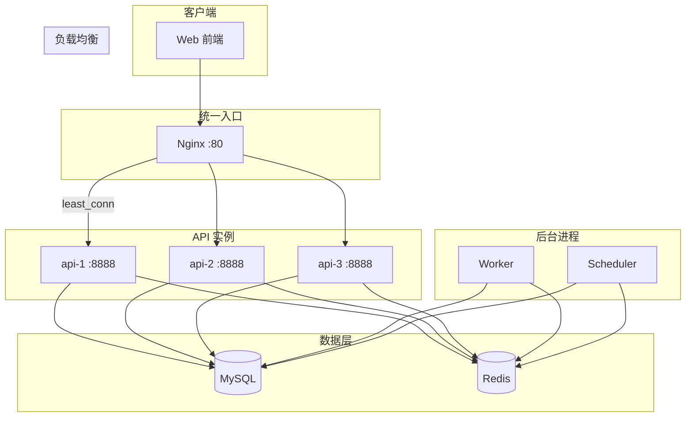

# 后端架构 v2：可扩展单体集群

在 v1 增强型单体基础上，实现 API 多实例与 Nginx 负载均衡，具备水平扩展能力。

---

## 1. 与 v1 的差异

| 维度 | v1 | v2 |
|------|----|----|
| API 实例数 | 1 | 3（可调） |
| 负载均衡 | 无 | Nginx upstream（least_conn） |
| 实例标识 | - | X-Instance-ID 响应头 |

---

## 2. 架构图



---

## 3. 负载均衡配置

Nginx 使用 `least_conn` 策略，将请求分发到连接数最少的 API 实例：

```nginx
upstream api_backend {
    least_conn;
    server api1:8888 max_fails=3 fail_timeout=30s;
    server api2:8888 max_fails=3 fail_timeout=30s;
    server api3:8888 max_fails=3 fail_timeout=30s;
}
```

- `least_conn`：优先选择当前连接数最少的后端
- `max_fails=3 fail_timeout=30s`：连续失败 3 次后暂停 30 秒，实现故障摘除

---

## 4. 实例标识与验证

每个 API 实例通过 `APP_INSTANCE_ID` 环境变量标识（如 api-1、api-2、api-3）。响应中会带上 `X-Instance-ID` 头，便于验证负载均衡：

```bash
# 连续请求，观察 X-Instance-ID 是否轮换
for i in {1..6}; do
  curl -sI http://localhost/api/healthz | grep X-Instance-ID
done
```

`/api/healthz` 的 JSON 中也会包含 `instance_id` 字段。

---

## 5. 无状态设计说明

### 5.1 无状态的含义

API 无状态指：**任意请求可由任意实例处理，不依赖单实例内存中的会话或上下文**。多实例部署时，同一用户的前后请求可能被不同实例处理，若存在实例级状态，将出现“已登录却返回未认证”等问题。

### 5.2 本项目的无状态依据

| 维度 | 实现方式 | 说明 |
|------|----------|------|
| **认证** | JWT（自包含、无服务端 Session） | Token 含 user_id、role 等，任意实例均可验证，无需查询 Redis/DB |
| **会话** | 无服务端 Session 存储 | 不依赖实例内存，登录态完全由客户端携带 Token |
| **配置** | 从 MySQL 读取 + 进程内缓存 | 各实例缓存内容一致，来源相同 |
| **点赞/收藏** | Redis 中心化存储 | 状态在 Redis，非实例本地 |
| **业务数据** | MySQL 中心化存储 | 所有实例读写同一库 |

因此，同一 Token 无论由 api-1、api-2 还是 api-3 处理，行为一致，满足无状态要求。

### 5.3 可复制的验证步骤

**前提**：已构建镜像并启动全栈（`docker build -t bookadmin:latest .` 后执行 `docker compose up -d`），服务运行正常。

---

**步骤 1：验证负载均衡**

连续发请求，观察 `X-Instance-ID` 是否在多个实例间分布：

```bash
# 发 12 次请求，统计各实例被命中的次数
for i in $(seq 1 12); do
  curl -sI http://localhost/api/healthz | grep -i x-instance-id
done | sort | uniq -c
```

预期：三个实例（api-1、api-2、api-3）均会被命中，次数大致均匀。

---

**步骤 2：验证同一 Token 跨实例可用（无状态核心验证）**

若 API 有状态（如 Session 存在实例内存），则只有“创建 Session 的那台实例”能识别该 Session；其他实例会返回 401。使用 JWT 时，任意实例都能验证 Token，因此跨实例应始终返回 200。

```bash
# 2.1 登录获取 Token
TOKEN=$(curl -s -X POST http://localhost/api/auth/login \
  -H "Content-Type: application/json" \
  -d '{"username":"admin","password":"admin123"}' \
  | grep -o '"token":"[^"]*"' | cut -d'"' -f4)

# 2.2 用该 Token 连续请求需要认证的接口（如获取用户信息）
# 多次请求会经负载均衡打到不同实例
for i in $(seq 1 10); do
  RESULT=$(curl -s -w "\n%{http_code}" \
    -H "Authorization: Bearer $TOKEN" \
    http://localhost/api/auth/userInfo)
  HTTP_CODE=$(echo "$RESULT" | tail -n1)
  INSTANCE=$(curl -sI -H "Authorization: Bearer $TOKEN" http://localhost/api/auth/userInfo | grep -i x-instance-id | tr -d '\r')
  echo "请求 $i: HTTP $HTTP_CODE, $INSTANCE"
done
```

预期：所有请求均返回 `HTTP 200`，且 `X-Instance-ID` 在不同实例间轮换。若出现 401，则说明存在实例级会话依赖，非无状态。

---

**步骤 3：验证实例宕机后业务仍可用**

模拟单实例故障，确认负载均衡摘除该实例后，其余实例继续正常服务：

```bash
# 3.1 记录当前三个实例均正常
curl -s http://localhost/api/healthz | jq .

# 3.2 停止其中一个 API 实例（如 api-2）
docker stop bookadmin-api-2

# 3.3 再次请求，应仍返回 200（由 api-1 或 api-3 处理）
curl -s http://localhost/api/healthz
curl -s -H "Authorization: Bearer $TOKEN" http://localhost/api/auth/userInfo | jq .code

# 3.4 恢复实例
docker start bookadmin-api-2
```

预期：停止 api-2 后，请求仍能成功，且 `X-Instance-ID` 仅出现 api-1、api-3。

---

**步骤 4：一键验证脚本**

项目内置脚本 `scripts/verify_stateless.sh`，可一键完成上述验证：

```bash
chmod +x scripts/verify_stateless.sh
./scripts/verify_stateless.sh
```

若服务不在本地 80 端口，可设置环境变量：`BASE_URL=http://your-host:port ./scripts/verify_stateless.sh`

---

## 6. 分布式追踪（OpenTelemetry + Jaeger）

v2 已接入 OpenTelemetry，将链路数据发送到 Jaeger，实现请求级可观测性与链路排查。

### 6.1 能力概览

| 能力 | 说明 |
|------|------|
| HTTP 请求 | 每个请求生成 `trace_id`，自动记录 method、route、status |
| GORM 数据库 | 自动为 SQL 调用创建 span，包含 query、table |
| Redis | 自动为 Redis 命令创建 span（通过 redisotel） |
| 响应头 | `X-Trace-ID` 便于前端/日志关联 |
| 链路关联 | API 层与 Service 层透传 `c.Request.Context()`，GORM 使用 `global.DB(ctx)`，DB/Redis span 与 HTTP span 形成父子关系 |

### 6.2 配置

`config.yaml` 中：

```yaml
tracing:
  enabled: true
  endpoint: localhost:4317   # OTLP gRPC 端点
  service: bookadmin-api
```

环境变量：`TRACING_ENABLED`、`OTEL_EXPORTER_OTLP_ENDPOINT`、`OTEL_SERVICE_NAME`

### 6.3 Docker 部署

`docker-compose.yml` 已包含 Jaeger 服务，API 容器通过 `OTEL_EXPORTER_OTLP_ENDPOINT=jaeger:4317` 将链路发送到 Jaeger。

- **Jaeger UI**：http://localhost:16686
- **OTLP gRPC**：4317

### 6.4 验证追踪

1. 启动全栈：`docker compose up -d`
2. 发起任意 API 请求，例如：`curl -sI http://localhost/api/healthz`
3. 在响应头查看 `X-Trace-ID`
4. 打开 http://localhost:16686，在 Jaeger UI 中选择 Service `bookadmin-api`，点击 Find Traces
5. 查看 trace 详情，应包含 HTTP、DB、Redis 等 span

---

## 7. 部署说明

与 v1 相同：先构建镜像 `docker build -t bookadmin:latest .`，再执行 `docker compose up -d`。会启动 3 个 API 容器（api1、api2、api3）、Jaeger、Nginx，Nginx 自动做负载均衡。

---

## 8. 毕设展示要点

1. **无状态设计**：API 不依赖本地内存状态，Session/Token 在 Redis 或 JWT 中，可任意扩缩实例
2. **水平扩展**：通过增加 API 实例数提升吞吐，压测可对比单实例 vs 多实例的 QPS、P99
3. **负载均衡策略**：least_conn 适用于长短请求混合场景
4. **故障摘除**：某实例不健康时，Nginx 自动剔除，不影响整体可用性
5. **分布式追踪**：OpenTelemetry + Jaeger 实现请求链路可观测，X-Trace-ID 便于前后端排查
