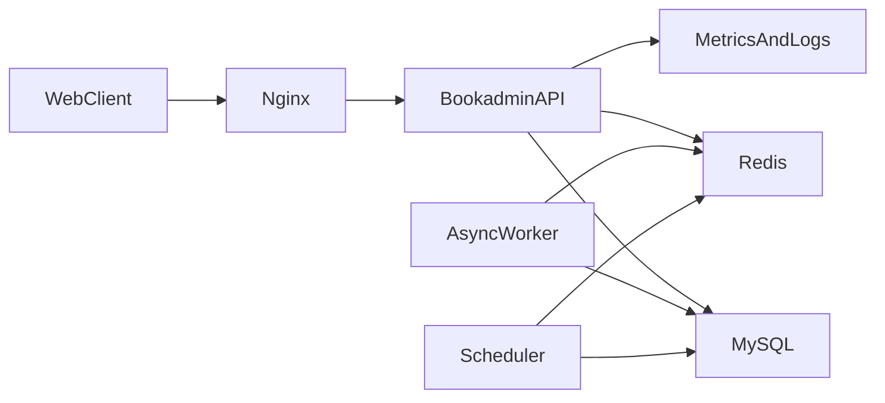

# 后端架构演进方案

基于当前 Go 单体 + MySQL + Redis 的项目现状，给出一套从单机开发架构演进到可上线、可扩容、可运维架构的分阶段方案，优先避免过早微服务化。

---

## 当前判断

项目当前是 `Go(Gin) + MySQL + Redis` 的单体后端，HTTP、定时任务、异步 worker 都在一个进程里启动，属于“业务已经成型，但工程化和可运维性偏初级”的阶段。

关键证据：

- 后端单入口在 [main.go](/main.go)
- MySQL 初始化硬编码在 [initialize/gorm.go](/initialize/gorm.go)
- Redis 初始化硬编码在 [initialize/redis.go](/initialize/redis.go)
- 已有 Redis Stream 异步链路和 worker，在 [worker/sync_worker.go](/worker/sync_worker.go)
- 已有进程内 cron，在 [initialize/cron.go](/initialize/cron.go)
- 当前 `docker-compose` 只编排了 MySQL/Redis，在 [docker-compose.yml](/docker-compose.yml)

---

## 推荐路线

不建议直接拆微服务。更适合走“增强型单体 -> 可扩展单体 -> 再决定是否拆服务”的路线。

---

## 阶段一：最小可上线架构

目标：先让系统从“本机开发型”升级成“稳定可部署型”。

建议事项：

- 统一配置中心：把 [config.yaml](/config.yaml) 真正接入运行时，支持环境变量覆盖。
- 去掉基础设施硬编码：优先替换 [initialize/gorm.go](/initialize/gorm.go)、[initialize/redis.go](/initialize/redis.go)、[main.go](/main.go) 里的固定地址、账号、端口。
- 容器化应用：补后端 `Dockerfile`，再决定前端是单独构建还是由 Nginx 托管静态资源。
- 增加反向代理：生产建议用 `Nginx` 统一入口，负责 TLS、静态资源、`/api` 转发。
- 增加健康检查：补 `/healthz`、`/readyz`，为部署和监控做准备。
- 优雅停机：把当前 API、worker、cron 的退出流程做成 graceful shutdown。

这一步完成后，你就会得到一个适合正式部署的单体系统。

---

## 阶段二：把单体做成“可扩展单体”

目标：不拆服务，但先把边界和职责理顺。

建议事项：

- 调整分层：让 `api` 只负责参数、鉴权、响应；业务规则统一收口到 `service`。
- 引入 repository/store 层：逐步隔离 `Gorm` 细节，避免 handler 直接碰 `global.GVA_DB`。
- ==显式依赖注入：逐步减少 `global` 单例直接访问，让 `DB`、`Redis`、配置、logger 都可注入。==
- 模块化收口：优先按已有业务域收口，例如 `borrow`、`reservation`、`like/favorite`、`statistics`。

这一步的价值不是“好看”，而是为后续扩容、测试、异步治理做准备。

---

## 阶段三：提升异步链路可靠性

目标：把现在的 Redis Stream 模式从“能跑”升级成“稳定可运维”。

建议事项：

- 给 worker 增加 pending message 重试、claim、失败告警。
- 明确消费幂等策略，避免重复消费导致计数漂移。
- 增加积压深度、处理速率、失败次数等指标。
- 将 worker 从 API 主进程中拆成独立进程，至少在部署维度可单独扩缩。
- 对 cron 任务增加分布式锁或单实例执行保证，避免未来多副本重复执行。

重点文件：

- [worker/sync_worker.go](/worker/sync_worker.go)
- [service/redis_service.go](/service/redis_service.go)
- [initialize/cron.go](/initialize/cron.go)

---

## 阶段四：补齐可观测性与安全

目标：让系统进入“出问题能定位、上线能放心”的状态。

建议事项：

- 结构化日志补字段：请求 ID、用户 ID、模块名、耗时、错误码。
- 接入基础 metrics：QPS、错误率、延迟、Redis 延迟、MySQL 连接池、worker backlog。
- 区分运行环境：`dev/test/prod` 的配置与日志级别分开。
- 收紧安全：密码改哈希存储，JWT secret 配置化，CORS 不再全开放。
- 数据库迁移从 `AutoMigrate` 逐步过渡到受控 migration。

---

## 什么时候考虑拆微服务

只有满足下面至少 2 个条件时，才建议认真考虑微服务：

- 团队人数增长，模块由不同小组独立维护。
- 某些模块读写压力明显高于主系统，比如排行榜、消息、统计报表。
- 发布频率高，某个模块需要独立上线。
- 异步任务和 API 生命周期完全不同，必须独立扩缩容。

按你这个项目现在的状态，我判断还没到“拆服务最划算”的阶段。

---

## 直接可选的三套方案

### 方案A：增强型单体

适合：当前最推荐。

- 1 个 API 服务
- 1 个独立 worker 进程
- 1 个独立 scheduler 进程
- 1 个 MySQL
- 1 个 Redis
- 1 个 Nginx

优点：改造成本最低，收益最大，最适合你当前代码基础。

### 方案B：可扩展单体集群

适合：访问量上来，但团队还不大。

- 多个 API 实例
- 独立 worker/scheduler
- Redis 保持中心化
- MySQL 主从或云 RDS
- 补监控、日志、备份

优点：保留单体开发效率，同时具备水平扩容能力。

### 方案C：局部拆分服务

适合：点赞/收藏/消息/统计明显成为热点。

- 核心借阅系统仍保留单体
- 将异步热点模块拆为独立服务
- 通过消息队列或事件流解耦

优点：只拆最值得拆的部分，不会过度设计。

---

## 我的建议

如果你现在就要定方向，我建议选 `方案A -> 方案B` 的两阶段路线：

- 先把配置、部署、worker/scheduler 拆分、监控、安全补起来。
- 等业务量和团队规模真的上来，再看是否需要局部服务化。

这比直接上微服务更稳，也更符合你这个仓库当前的成熟度。

---

# v2优化

## 1. 方案 B 的核心：可扩展单体集群

目标：保持单体开发模式，但具备多实例、读写分离、高可用。

| 升级项                 | 价值          | 毕设展示点          |
| ------------------- | ----------- | -------------- |
| API 多实例 + 负载均衡      | 水平扩容、无状态设计  | 理解「无状态 + 水平扩展」 |
| MySQL 读写分离          | 读写分流、减轻主库压力 | 理解读写分离与一致性权衡   |
| Redis 高可用（Sentinel） | 缓存层不单点      | 理解高可用与故障转移     |
| 分布式追踪（Tracing）      | 请求全链路可见     | 理解可观测性与排障      |
| 限流与熔断               | 保护下游、防止雪崩   | 理解稳定性保障手段      |

---

## 2. 推荐升级路线（按投入产出排序）

### 第一优先级：API 多实例 + Nginx 负载均衡

- 做法：在 `docker-compose` 中起 2～3 个 API 容器，Nginx 用 `upstream` 做轮询/加权负载均衡
- 工作量：约 1～2 天
- 毕设要点：证明 API 无状态、可水平扩展；可以对比单实例 vs 多实例的 QPS 或响应时间

### 第二优先级：MySQL 读写分离

- 做法：增加一个只读从库；对统计、列表、搜索等读多写少的接口走从库；借还、预约等写操作走主库
- 工作量：约 2～3 天
- 毕设要点：读写分离、主从延迟、读写一致性讨论；可画架构图和时序图

### 第三优先级：分布式追踪（OpenTelemetry + Jaeger）

- 做法：在 Gin 中接入 OpenTelemetry，为每个请求生成 `trace_id`，贯穿 API → Redis → MySQL
- 工作量：约 1～2 天
- 毕设要点：可观测性设计；链路追踪在排查问题时的作用

### 第四优先级：限流与熔断

- 做法：在 Nginx 或 Go 层做全局限流（如 token bucket、滑动窗口）；对 Redis/MySQL 调用做熔断（如 gobreaker）
- 工作量：约 1 天
- 毕设要点：稳定性设计；如何防止雪崩、保护数据库等后端资源

---

## 3. 毕设可重点写明的几点

1. 架构演进文档：从单机到可扩展单体的演进过程、每步的权衡和依据
2. 容量与性能：压测结果（单实例 vs 2/3 实例的 QPS、P99 等），并解释多实例带来的提升
3. 高可用与故障恢复：如 Redis 故障时降级策略、MySQL 主从切换场景
4. 可观测性：日志 + 指标 + 追踪的组合，以及如何用于排查问题

---

## 4. 不建议在毕设阶段做的事

- 不做微服务拆分：改动大、与当前业务规模不匹配，收益有限
- 暂不引入 Kafka 等 MQ：已有 Redis Stream，能覆盖当前场景
- 暂不上 K8s：容器化 + Compose 足够，K8s 可以只在文档里展望

---

## 5. 总结与建议

对你这个毕设来说，**在现有基础上做「方案 B 的精简版」**比较合适：

- 先完成：API 多实例 + Nginx 负载均衡
- 有时间再做：MySQL 读写分离 或 分布式追踪 其中一项
- 毕设文档中：==把架构图、演进过程、压测和可观测性设计写清楚，就能充分体现架构与工程能力==

